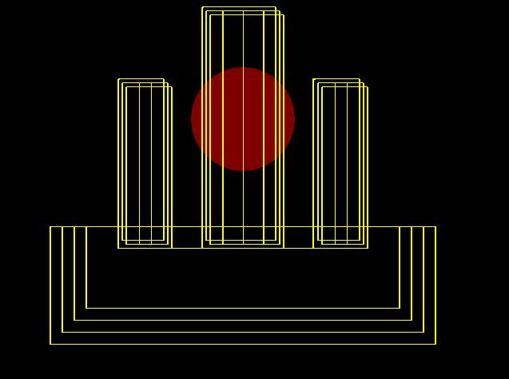
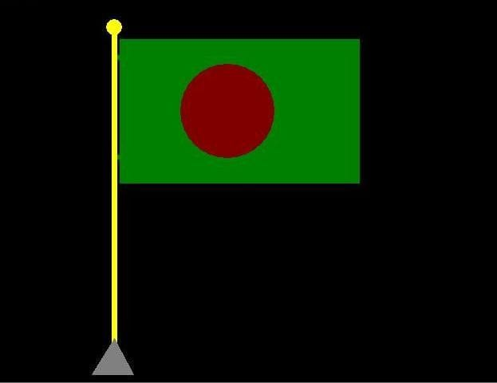

The Martyr Tower (Shaheed Minar)
================================

Overview
--------
This is a C++ BGI graphics animation that draws the Shaheed Minar and a
Bangladeshi flag. It commemorates International Mother Language Day
(21 February).

Final Output
------
<table width="100%">
	<tr>
		<td align="center">
			
			 
			Shaheed Minar
		</td>
		<td align="center">
			
			 
			Bangladesh Flag
		</td>
	</tr>
</table>

Files
-----
- main.cpp: Animated drawing of the Shaheed Minar and red sun.
- flag.cpp: Static drawing of the flag and pole.

Build and run
-------------
This project uses the legacy BGI graphics library (graphics.h). You need a
compiler/toolchain that provides BGI and the BGI runtime files.

Notes:
- The code currently initializes graphics with:
	initgraph(&gd,&gm,"c:\\TURBOC3\\BGI");
	Update the BGI path to match your environment.
- If you use WinBGIm/Code::Blocks on Windows, link with the BGI libraries.
- On Linux, use a compatible BGI port (for example, libgraph or SDL_bgi) and
	adjust build flags and include paths accordingly.

Usage
-----
- Run the program. The animation draws the scene.
- Press any key to close the window.

Credits
-------
Author: Rajesh Biswas (rajesh_1920)
Date: 21/02/2024.
